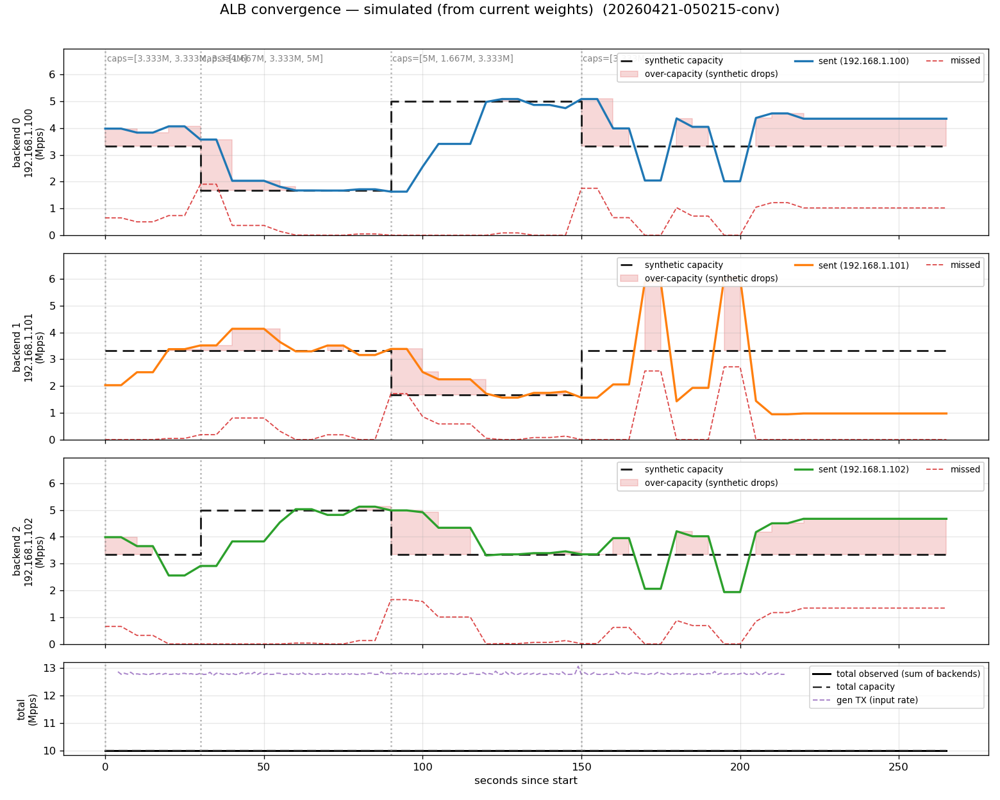
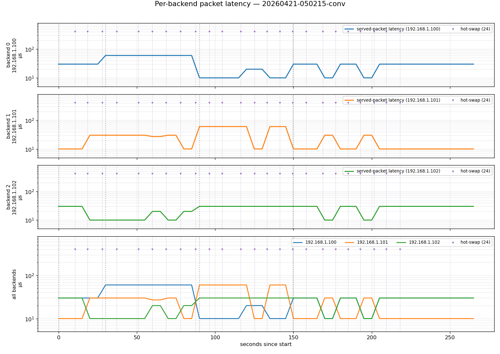
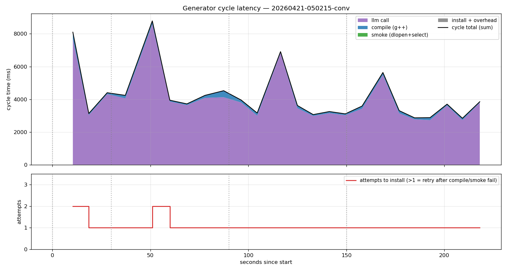

# ALB — Application Load Balancer

High-performance load balancer with hot-swappable strategies and DPDK packet processing.

## Quick Start

```bash
# Prerequisites (Ubuntu 22.04)
sudo apt-get install -y dpdk-dev libnuma-dev cmake git
sudo curl -fSL https://github.com/bazelbuild/bazelisk/releases/latest/download/bazelisk-linux-amd64 \
  -o /usr/local/bin/bazel && sudo chmod +x /usr/local/bin/bazel

# Build and install llama.cpp from source
sudo ./third_party/install_llama_cpp.sh

# Build & test
bazel build //...
bazel test //...
```

## Traffic Generator

```bash
bazel-bin/packages/traffic-generator/traffic-generator --vdev=net_null0 -l 0,1,2
```

Requires 3+ lcores: main (stats), workers (TX), last worker (RX drain).

## Tests

| Test | Description |
|------|-------------|
| `config_test` | Parses YAML configs, verifies IP/port/mac/weight parsing |
| `strategy_test` | Loads strategy via dlopen, verifies round-robin routing |
| `traffic-generator_build_test` | Verifies DPDK linkage |
| `eal_init_test` | DPDK EAL init with virtual device |
| `tx_test` | Verifies nonzero TX throughput |
| `llm_convergence_test` | LLM-driven strategy convergence under shifting backend capacity |
| `llm_generator_stub_test` | Generator CLI (stub mode) compiles + installs a valid .so end-to-end |

DPDK tests use `--no-huge --no-pci --vdev=net_null0` — no real NICs or hugepages needed.

## Packages

| Package | Description |
|---------|-------------|
| [balancer-strategies](packages/balancer-strategies/) | Pluggable load-balancing strategies (C++) |
| [config](packages/config/) | YAML config parser for backends (C) |
| [llm-strategy](packages/llm-strategy/) | LLM-driven strategy generator + convergence harness |
| [traffic-generator](packages/traffic-generator/) | DPDK packet generator (C) |
| [version-table](packages/version-table/) | Lock-free hot-swap table (C++) |

## Code Generation

Strategy `.so` files are generated by a self-hosted [llama.cpp](https://github.com/ggml-org/llama.cpp) instance running [Llama-3.1-8B-Instruct](https://huggingface.co/meta-llama/Llama-3.1-8B-Instruct) (GGUF). The generated code is compiled and hot-swapped into the balancer at runtime via inotify + dlopen.

## Results

End-to-end run from [test/results/example-test/](test/results/example-test/). Three backends, 10 Mpps baseline (exact saturation — `sum(caps) = 1.0`, no headroom), 4-phase capacity schedule over ~260 s:

| t (s) | caps fraction    | ratio   |
|-------|------------------|---------|
| 0     | [0.33, 0.33, 0.33] | equal |
| 30    | [0.17, 0.33, 0.50] | 1:2:3 |
| 90    | [0.50, 0.17, 0.33] | 3:1:2 |
| 150   | [0.33, 0.33, 0.33] | equal |

### Convergence



One subplot per backend: dashed black is synthetic capacity, solid line is sent-pps, red fill marks the over-capacity window where the previous strategy was still sending traffic to a backend that had just lost headroom. At each transition (30 s, 90 s, 150 s) the controller observes the miss signal, the LLM rewrites the strategy, and within roughly one control cycle the sent-pps tracks the new caps and the red area closes. Because the schedule runs at exact saturation there's no slack to hide in — every mismatch between the strategy's weights and the live capacity shows up as drops until the next hot-swap lands.

### Packet latency



Mean packet latency per backend (M/M/1 sojourn model against live sent/cap, log axis). Backends settle at the ~10 µs floor when within capacity and spike upward during the brief overload windows between a phase change and the next installed strategy. Purple down-triangles along the top mark each hot-swap — the density of swaps clusters around the phase-change markers where the controller is iterating fastest.

### Controller cycle latency



Per-cycle time broken out by phase. 24 installed cycles, **p50 ≈ 3.7 s, p95 ≈ 8.1 s, p99 ≈ 8.8 s**. The local LLM call dominates (avg ~4 s, purple), while `g++ -O2` compile (~140 ms, blue) and the dlopen+select smoke test (~5 ms, green) are rounding error by comparison. Two retries fired in the first minute (attempts=2 in the bottom panel) — the compile/smoke gate caught an invalid strategy before it could ever reach the ALB, and the controller regenerated on the next tick. This cycle time is the practical bound on how fast the system reacts: swap the LLM for a faster one (or the stub controller) and the whole loop drops to sub-200 ms, which is what the simulator convergence test exercises.

## Development

```bash
pip install pre-commit && pre-commit install
```
